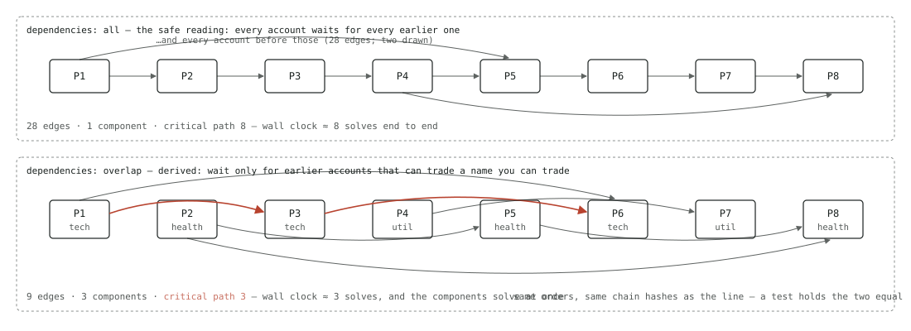

# portfolio-optimizer

A template repository for a JSON-driven, auditable portfolio-optimization engine built on pandas and cvxpy.
Clone it (or click **Use this template**), keep the engine, and write your own loaders, rules, term and
constraint kinds, solve steps, and sinks as ordinary Python.

A run is one JSON file, an order flow, and an as-of date. The engine loads the data the file names, assembles it,
applies your rules per portfolio, builds one problem per portfolio, solves along a dependency graph it
derives from the data, re-verifies every answer without cvxpy, rounds to whole-share orders, publishes
them, and writes a manifest that lets anyone reproduce and audit the run. A run is an inflow, an outflow, or a rebalance — it buys, it sells, or it does either to get a book
back inside its bounds: a desk's order flows are separate runs over one snapshot, and the template
ships one of each.

## The run config, block by block

The quickest way to see what the engine does is to read the inflow it ships with,
[`configs/example_inflow.json`](configs/example_inflow.json), annotated here:

```jsonc
// The inflow that ships with the template, annotated. The real file is strict JSON with no
// comments — these lines are stripped and the rest compared against it by a test, so this copy
// cannot drift. `configs/example_outflow.json` is the same wiring with three keys changed: the run's
// name, `order_flow`, and a `tax_cost` term on what is sold; `configs/example_rebalance.json` changes
// the first two only.
{
  // Identity for people: recorded in the manifest, kept out of the config hash. The instant the
  // run is *as of* is not here either — it is `run --as-of`, so one wiring runs every day under
  // one hash and `diff-manifests` compares Monday with Tuesday.
  "run": {"name": "example_inflow", "tags": {"desk": "template"}},

  // The run's order flow: cash coming into the book, going out, or neither. `inflow` buys: every
  // name has one variable, its target weight, with the buy an expression of it and no sell vector at
  // all; `outflow` sells, the mirror; `rebalance` may do either, with buy and sell the positive and
  // negative parts of the change. One variable per name whichever it is, so nothing is bought and
  // sold in one solve. Portfolios couple through the trades the order flow makes.
  "order_flow": "inflow",

  // Every input the run loads. Each dataset starts the moment the datasets its `depends_on` names
  // have loaded — with no dependencies, immediately — so the stage costs its longest chain rather
  // than its sum. Each loader stands in for a service — a custodian, a security master, an account
  // master — and waits as long as that source would; nothing here is a file read in a real run.
  "datasets": {
    // The book of record: the portfolio ids and their solve priorities. A dataset like any other —
    // only the inputs that ask for its ids wait on it. A fixed book can skip the loader and be
    // written inline: "portfolios": ["P1", "P2"].
    "portfolios": {"loader": "load_portfolios"},

    // `per_portfolio` is the engine's fan-out: one call per batch of accounts, `batch_size: 1`
    // being a call each — the shape of a custodian that answers one at a time — and it implies
    // `depends_on: ["portfolios"]`. A hundred calls at once is more than the vendor allows, so
    // `max_in_flight` keeps eight of them running and queues the rest.
    "holdings": {
      "loader": "load_holdings",
      "scope": "per_portfolio",
      "batch_size": 1,
      "max_in_flight": 8
    },

    // No `scope` means `global`: one call for the book, and the only datasets assembly sees. No
    // `depends_on` means it starts at once — this one is the run's long pole, and it no longer
    // waits for the book of record to answer first.
    "universe": {"loader": "load_universe"},

    // The account master: NAV, cash, tax rates, style limits, and any other column the desk keeps
    // on an account. `batch_size: 25` hands the loader twenty-five ids per call — the shape of a
    // source that takes a list — and four of those queries may be open at once.
    "details": {
      "loader": "load_details",
      "scope": "per_portfolio",
      "batch_size": 25,
      "max_in_flight": 4
    },

    // Which constraints bind each account and how tight they are: one typed row each, a `kind`
    // naming the model and `params` holding its fields. The engine reads `portfolio_id` and the
    // declaration it schedules by; the solve step renders the rest. `depends_on` hands the loader
    // the book's ids as `request.portfolio_ids`, so compliance is asked about the book, not the firm.
    "constraints": {"loader": "load_constraints", "depends_on": ["portfolios"]},

    // A name the engine does not know is an extra: carried untouched to the rules and on to the
    // solve step, which is where runtime parameters belong. One loader, two sets, each named by
    // its dataset.
    "global_parameters": {"loader": "load_parameters"},

    // The same shape, read earlier: `restrict_low_liquidity` takes its `min_adv_shares` here.
    "buy_universe_parameters": {"loader": "load_parameters"}
  },

  // Applied in order to each portfolio's bundle; a rule never sees another portfolio.
  "rules": ["restrict_low_liquidity"],

  // The sum is minimized, so a reward has a negative weight. Every term is a typed model: `linear`
  // is `weight · columnᵀvector` over any per-security column the spec carries — the exported
  // `alpha`, the derived `tcost_per_dollar` — and a decision vector. The outflow adds a third
  // term, `tax_per_dollar` against `sell`: a term that reads a side the run lacks is refused at
  // `validate-config`, which is why it is not here.
  "objective": [
    {"kind": "linear", "name": "alpha", "column": "alpha", "weight": "-1"},
    {
      "kind": "linear",
      "name": "transaction_cost",
      "column": "tcost_per_dollar",
      "vector": "trade"
    }
  ],

  // The solve step and its own parameters: `cvxpy` renders the terms and the typed constraint rows
  // and solves with the solver named here, checked when the config resolves and on every worker;
  // no fallback to another solver. A heuristic or your own library is a different step.
  "solve": {
    "name": "cvxpy",
    "params": {"solver": "CLARABEL", "options": {"max_iter": 200}, "time_limit_s": 60.0}
  },

  // Tolerances for the independent, cvxpy-free re-verification of every solution.
  "post_solve": {"violation_tol": 1e-6, "objective_rel_tol": 1e-5, "objective_abs_tol": 1e-9},

  "sink": {"name": "orders_to_parquet", "params": {"subdir": "orders"}},

  // `fail_fast` stops at the first failure; `continue` isolates it. `dependencies` is `overlap`,
  // the derived graph, or `all`, the strict line — the same answer, for diagnosis.
  "execution": {"on_error": "fail_fast", "dependencies": "overlap"}
}
```

Most values are *steps*: a function named either by a bare name, looked up in the template module for
that kind of step or among the steps installed packages publish, or by `package.module:function`, with
optional `params` (see [the one convention](#the-one-convention)). Top to bottom:

- **`run`** — the run's identity. `name` and `tags` go into the manifest and nothing else; they are kept
  out of the config hash, as is the as-of date, which is a run argument.
- **`order_flow`** — `inflow`, `outflow`, or `rebalance`: whether cash comes into the book, goes out, or
  neither, so whether the run buys, sells, or may do either. It fixes what a trade means, which trades
  portfolios couple through, and which direction cash can move. A term or row that reads a side an
  inflow or an outflow lacks is refused before any data loads, and so is a term that rewards a side
  under a rebalance, where buy and sell are convex rather than affine. The other side does not exist in the
  problem, and a term or row that reads it is refused before any data loads.
- **`datasets`** — everything the run loads, every one a frame, scheduled as the dependency DAG the
  entries declare. `portfolios` is the required first fact; `holdings`, `universe`, and `details` are
  required and validated against fixed schemas — each accepts any further columns, which the build
  exports by name; `constraints` is engine-known but optional. Any other name is an extra dataset the
  engine does not interpret. Each entry also says how its loader is called: `global` is one call for
  the book, `per_portfolio` one call per batch of `batch_size` accounts, at most `max_in_flight` open.
- **`rules`** — business logic, run per portfolio in order: each takes one portfolio's validated bundle
  and returns a modified one, and never sees other portfolios.
- **`objective`** — typed terms whose sum is minimized; a reward is a negative weight. Every kind carries
  both halves of itself: what the cvxpy step renders and what the verifier recomputes in numpy.
- **constraints** — *which* constraints apply and *how tight* they are, both from the data: a typed row
  per constraint per account, its numbers on the row or read from the account's details (a spec scalar)
  or a per-security column. One kind is chain-aware — it reads what higher-priority portfolios have
  already traded — and that is the only reason one portfolio ever waits for another.
- **`solve`** — the step that decides the weights and its own parameters; `cvxpy` is the default, and its
  solver is checked when the config resolves, with no silent fallback.
- **`post_solve`** — tolerances for the verifier that re-checks every solution in plain numpy without
  cvxpy: each constraint's residual and the gap between the recomputed and reported objective.
- **`sink`** — where the orders go, called once with every solved portfolio's orders.
- **`execution`** — what one failed portfolio does to the rest. *Where* the work runs and how many workers
  there are is an environment setting, so a laptop run and a cluster run of one config hash identically.

Three keys the example leaves at their defaults: `assembly` (steps that reshape the loaded datasets
before the engine-known frames are validated), `build` (`standard`; the step that turns a bundle into a
problem, replaceable for tax lots or a factor block), and `solve_order` (a step that computes each
portfolio's priority from the data instead of the column).

Numbers — positions, prices, caps, bands, tax rates, a liquidity threshold — are never in the config;
they live in the data, including the run's own parameters. The instant is a run argument. Behavior lives
in the functions and kinds the config names.
[Reading a run config](docs/explanation-run-config.md) explains each block in depth,
[the reference](docs/reference-run-config.md) covers what the schema cannot say, and
`configs/run-config.schema.json` — generated from the models — lists every key with its type,
default, and description.

## The solve schedule is a derived graph

The state of the art in production rebalancing is parallel builds and a *sequential* solve, because a
chain-aware constraint seems to force one: when account *j* may only take what is left of a name's
daily volume after the accounts ahead of it took theirs, the safe reading of that dependency is a
line — *N* solves end to end. The line is the worst case, not the truth. Two accounts that cannot
trade a security in common cannot affect each other's feasible set, whatever their constraints read.
So the engine derives the real object: every portfolio builds in parallel and reports its tradable
set, and a portfolio waits only for the higher-priority portfolios whose tradable set intersects what
its own chain-reading constraints consume. Wall clock is the graph's critical path times a solve, not
*N* times a solve, independent components solve at once, and the head of the book is solving while the
tail is still building. A run in which nothing reads the chain — no chain-aware kind in any row, the
shipped solve step — is told so before any build, and nothing waits at all.



What makes that a result rather than a claim: `execution.dependencies: "all"` runs the same book as
the strict line, and produces **byte-identical orders and chain hashes** — a property test asserts
it, and `benchmarks/run_book.py` runs both schedules over synthetic books on a real cluster.
Measured 2026-08-30 (8 local workers, Clarabel; the manifest's own `schedule` and `timing` blocks):

| Book | Derived: edges · components · critical path | Wall clock |
|---|---|---:|
| 100 accounts, 10 disjoint mandates, 2,000 names (~0.14s solves) | 450 · 10 · 10 | **6.9s** |
| — the same book as the line (`dependencies: all`) | 4,950 · 1 · 100 | 14.9s |
| 12 accounts, 4 disjoint mandates, 30,000 names (~2s solves) | 12 · 4 · 3 | **14.0s** |
| — the same book as the line | 66 · 1 · 12 | 24.6s |
| 1,000 accounts, 10 disjoint mandates | 49,500 · 10 · 100 | 34.1s — capacity-bound, 6.1× parallel on 8 workers |

The honest counterweight: overlap is on *any* shared tradable name, so the win belongs to books
partitioned by mandate, universe, or restriction list (`restrict_to_mandate` is the shipped shape).
A book whose accounts all trade one universe is a complete DAG — the shipped example is deliberately
that case, and its own manifest says so: `edges 4950, critical_path 100` — and a single sector shared
between neighbouring mandates is enough to chain the book back into a line. Typed constraint rows
narrow that reading: a row declares whether it reads the chain and, through its `scope`, which names
it couples through, so a portfolio whose constraints read no chain waits for nobody. How the graph is
derived and why it is exact is in
[the architecture explanation](docs/explanation-architecture.md#a-run-couples-through-its-one-side-so-the-schedule-is-a-graph);
the `trace.json` beside every manifest draws where the run's wall clock went.

## Quick start

```bash
uv sync --locked
uv run portfolio-optimizer validate-config configs/example_inflow.json
uv run portfolio-optimizer run configs/example_inflow.json --data-root examples/data --as-of 2026-08-28T00:00:00Z
uv run portfolio-optimizer run configs/example_outflow.json --data-root examples/data --as-of 2026-08-28T00:00:00Z
uv run portfolio-optimizer run configs/example_rebalance.json --data-root examples/data --as-of 2026-08-28T00:00:00Z
```

No settings are needed: every one has a default, and the default cluster is `inline` — every task in
this process, one after another, which is also where a rule is stepped through under a debugger. The
example is a hundred accounts over three securities, and each order flow takes about half a minute, of
which almost all is the shipped loaders pretending to be the services they stand in for. The inflow
puts each account's cash to work inside the book's shared liquidity; the outflow harvests
the lots held at a loss; the rebalance does the inflow's buys and sells the negative-alpha name down
to its sector floor in the same solve. The first two accounts have a hand-checkable optimum under each; see
[the tutorial](docs/tutorial-first-run.md) for what to expect at each step.
`portfolio-optimizer steps` lists every step and every term and constraint kind the environment can name.

## The one convention

A step is an ordinary function in a designated module; the JSON run config names it.

```python
# src/portfolio_optimizer/rules.py
class CapSingleNameParams(Params):
    max_weight: Decimal = Field(gt=0, le=1)


def cap_single_name(data: PortfolioData, params: CapSingleNameParams) -> PortfolioData: ...
```

```json
"rules": [{"name": "cap_single_name", "params": {"max_weight": "0.05"}}]
```

No decorators, no registries. The function may live in the template modules or in any package installed
in the environment: name it `my_firm.rules:cap_single_name` and the engine imports it from there, or
publish it as an entry point in the group `portfolio_optimizer.rule` and name it bare — which is how a
firm shares loaders, rules, and sinks across desks, with the package's version recorded in every manifest.
Before any data loads, the engine imports every named function, checks its signature, validates its
`params` against the function's own model, and records its source hash in the run manifest. Loaders,
assembly steps, rules, solve-order steps, the build step, solve steps, and sinks follow the same rule.

Terms and constraints are *kinds* rather than steps: strict pydantic models that carry both halves of
themselves, `to_cvxpy` for the shipped solve step and `value` or `residual` in plain numpy for the
verifier, so nothing the solver was told goes unchecked. A kind a package publishes in the group
`portfolio_optimizer.term` or `portfolio_optimizer.constraint` is known everywhere a shipped one is —
the resolver, the schedule, the solve step, the verifier, the JSON Schema.

Run configs are validated by `portfolio-optimizer validate-config`, which imports and checks every step
and term, and by any JSON Schema validator against [`configs/run-config.schema.json`](configs/run-config.schema.json).
Adding `"$schema": "./run-config.schema.json"` to a config gets the same completion and validation live in
an editor; the engine accepts the key and ignores it.

## Layout

| Path | Role |
|---|---|
| `src/portfolio_optimizer/{loaders,assembly,rules,solve_order,solvers,sinks}.py` | **Yours to edit.** Each ships worked, tested examples. Shared steps live in your own installed package instead and are named `package.module:function` or published as entry points. |
| `src/portfolio_optimizer/engine/` | Loading and assembly, the rule pipeline, the standard build step, the solve stage, cvxpy-free verification, orders, the per-portfolio tasks, the derived dependency graph, the inline and Dask backends, manifest. Rarely edited. |
| `src/portfolio_optimizer/domain/` | Frame schemas, the per-portfolio data bundle and its optimizer frame, the pure-data problem spec and results, the typed constraint and term kinds and their registry, and `order_flow.py`: the order-flow profiles. |
| `src/portfolio_optimizer/config/` | The run-config models, the step resolver, and the JSON Schema generator. |
| `src/portfolio_optimizer/cvx/` | `adapter.py`, the only module that imports cvxpy, and `order_flow.py`, the order-flow profiles' cvxpy half: each order flow's decision variable and trade identity. |
| `src/portfolio_optimizer/solving.py` | The solve step's contract: `SolveRequest` in, `SolveResult` out; the solver table. |
| `configs/example_inflow.json`, `configs/example_outflow.json`, `configs/example_rebalance.json`, `configs/run-config.schema.json`, `examples/data/` | The shipped example — an inflow, an outflow, and a rebalance over one book of a hundred accounts and three securities, one CSV table per source — and the generated JSON Schema. |
| `benchmarks/` | `profile_portfolio.py` times one portfolio through the pipeline stage by stage at a chosen book size and order flow; `run_book.py` and `run_state_book.py` run a synthetic book of *N* portfolios on a local cluster and report the derived schedule and the timing spans, sharing the run harness in `harness.py`. The numbers in `IDEAS.md` come from them. |
| `docs/` | Tutorial, how-to guides, reference, and explanation. |
| `IDEAS.md` | Threads that are not yet decisions, and known defects waiting to be fixed. |

## Documentation

- [Tutorial: your first run](docs/tutorial-first-run.md)
- [Explanation: reading a run config](docs/explanation-run-config.md) — the walkthrough above, in depth
- [How to add a rule](docs/how-to-add-a-rule.md)
- [How to add a loader or a sink](docs/how-to-add-a-loader-or-sink.md)
- [How to add security analytics columns to holdings and the universe](docs/how-to-add-security-analytics.md)
- [How to add an objective term or a constraint kind](docs/how-to-add-a-term.md)
- [How to set the solve order](docs/how-to-set-the-solve-order.md)
- [How to run an order flow: inflow, outflow, rebalance](docs/how-to-run-an-order-flow.md)
- [How to replace the cvxpy solve with your own function or library](docs/how-to-write-a-solve-step.md)
- [How to run on a cluster](docs/how-to-run-on-a-cluster.md)
- [Reference: the run config](docs/reference-run-config.md)
- [Reference: the per-portfolio bundle and the optimizer frame](docs/reference-portfolio-data.md)
- [Reference: outputs, the manifest, and the CLI](docs/reference-manifest.md)
- [Explanation: how the engine is built and why](docs/explanation-architecture.md)
- [Explanation: the life of a run](docs/explanation-run-lifecycle.md)

## Development

```bash
uv sync --locked
uv run pre-commit run --all-files   # ruff format and check, ty, uv lock, prettier for JSON
uv run pytest                       # unit, property, and smoke tests; warnings are errors
```

The default cluster is `inline`. `PORTFOLIO_OPTIMIZER_CLUSTER=local` provisions Dask worker processes
on this machine for the run and tears them down when it ends; a Dask Gateway address needs the `gateway`
extra (`uv sync --locked --extra gateway`). See [how to run on a cluster](docs/how-to-run-on-a-cluster.md).

Python 3.12 or newer. Dependencies are locked in `uv.lock`; solver versions are recorded in every manifest.
