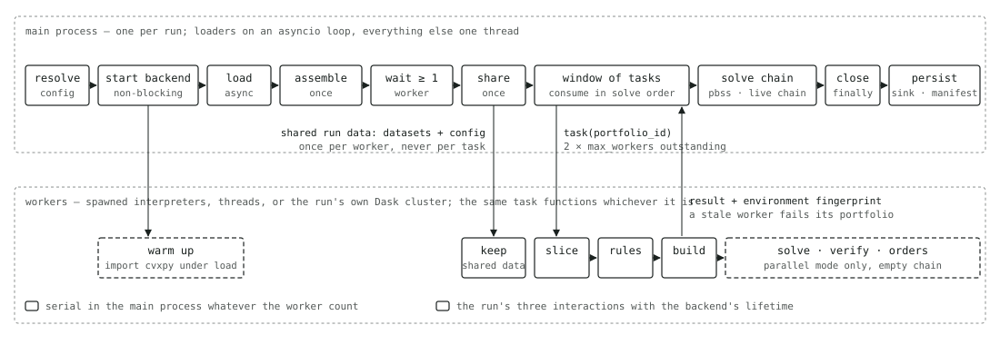
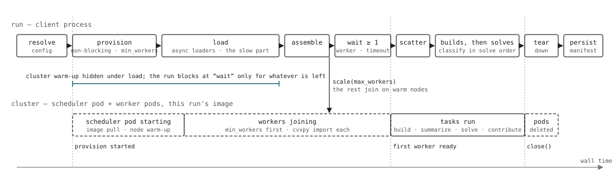

# Explanation: how the engine is built and why

This page explains the design decisions behind the template — what the engine promises, where those
promises are enforced, and what was deliberately left out. For the same engine narrated in execution
order, stage by stage, see [the life of a run](explanation-run-lifecycle.md).

## One convention instead of a framework

Quant developers who clone this repository want to write Python, not learn a plugin system. So the only
mechanism for extending the engine is: write an ordinary function — in a designated module of this repository or in any installed
package — and name it in JSON. The engine's resolver (`config/resolve.py`) does the work a framework would normally push onto the
author — it imports the function, checks its signature against the contract for its kind, validates the
JSON parameters against the function's own `Params` model, and detects optional context arguments by
name — and it does all of this before any data is loaded. A mistake surfaces as a config error with the
function's qualified name, not as a traceback halfway through a run.

The convention has a second purpose: auditability. Because every step is a named function, the manifest
can record its qualified name and the hash of its source text. A run can be traced to the exact business
logic that produced it, and two runs can be compared to find whether code, data, or the solver changed.

## Loading is the slow part, so it is concurrent and metered

In production the datasets come from APIs and databases, and waiting on them dominates a run. The load
stage is therefore asynchronous: after the portfolio list — whose ids every other request needs — all
dataset loaders start at once, `async def` loaders on the event loop and plain ones in worker threads.
Loaders are the only step kind that may be async; everything downstream is pure and synchronous.

A backend has limits, and a source that answers one portfolio per call will hit them on a large run.
Backends also differ: a vendor API may tolerate two concurrent requests where a warehouse takes
thirty-two. So every input carries its own bound — a token bucket plus an in-flight cap — either
inline and private to it, or as the name of a shared pool when two inputs come from the same backend;
the loader draws from it through `request.rate_limiter`. The limiter is one object usable from both
async code and threads, so a sync loader and an async loader on the same API cannot exceed the limit
between them. The manifest records each input's load time and the log each limiter's wait, so "why was
this run slow" has an answer.

## Assembly is a step kind, and the bundle is two tables

Combining datasets is business logic — which vendor's price wins, how two custodians' files become one
holdings table, what a z-score is normalized against — so it follows the same convention as everything
else: an ordinary function, `(frames: Frames[, params]) -> Frames`, named in the config's `assembly`
list, run once per run over every loaded dataset, and recorded in the manifest with its source hash,
its parameters, the row count of every dataset before and after, and the columns it added. The
shipped `join`, `union`, `select`, and `drop` cover the recurring shapes; anything else is a function
of the same shape in the desk's package. Making assembly a step kind rather than a fixed join
vocabulary is what lets a run's data preparation be audited the same way its rules are, and it is why
a dataset the engine does not know can still be used: it stays visible to every step by name and is
carried into each portfolio's bundle as an extra for a rule to read.

The bundle itself is deliberately two tables, not one: `holdings` (owned, with cost basis) and
`universe` (buyable, with price and liquidity). Both accept any analytics columns beyond their schemas,
a held name need not be buyable, and `PortfolioData.optimizer_frame()` stacks them into the single
frame an optimizer wants — holdings rows then universe rows, over the union of columns, with typed
nulls where one side lacks a column. The one invariant this needs is that a column present on both
tables has the same dtype on both, so the bundle checks it on every construction and names the column
when it fails. That check is what makes "attach a score to both tables" safe to do in a loader, a step,
or a rule: whichever produced a mismatch is the one that fails.

## Two conversions, in two places

Money enters the engine as `Decimal` and stays that way through loading, assembly, and rules; frame
schemas reject a float where a Decimal belongs. The optimizer needs float64, so `engine/build.py` is the
one place the conversion happens — after current weights and tax per dollar have been computed exactly.
Orders need exact quantities and notionals again, so `engine/orders.py` is the one place float64 becomes
shares and `Decimal`, using the exact prices carried alongside the spec rather than the float copies
inside it. Keeping both conversions in single, tested functions is what makes "the notional in the
order is exactly quantity times price" a guarantee rather than a hope.

## The spec is pure data

`ProblemSpec` holds every input the solver will see as plain numpy arrays — and the sector membership as a
sparse matrix, one nonzero per security, since dense it was most of every large spec — aligned to a sorted list of
securities, plus a content hash. cvxpy objects are created only inside `solve()` and never leave it. This
buys three things: the spec is built on a worker and stays there until it is solved; it can be persisted as an `.npz` file that an auditor can open without the solver stack; and the hash pins down
exactly what was optimized, so a change in any input changes the hash and shows up in `diff-manifests`.

## The side a run trades is one object

A run's `sides` selects a *side profile* (`domain/sides.py`, with its cvxpy half in `cvx/sides.py`):
the one place in the engine that knows what the side means. The profile supplies the trade identity
to every solve, turns the solver's weights into the reported buy/sell split, names the tradable set
the dependency graph and the chain state are built from, reduces a solved portfolio to what a
dependent receives, and hands the verifier the identity's numpy twin. Nothing else branches on the
side. Today there is one profile, `both` — buys and sells in one problem, coupling through buys only;
the one-sided profiles are what make a buy-only or sell-only run a third of the problem with no wash
trade possible, and they slot in without touching the rest of the engine.

## The solve step is the interpreter

What the engine knows about a constraint is deliberately little: it is a strict model in the config
with a unique label, it declares whether it reads the chain (which is what the dependency graph is
derived from), and the verifier may know how to check it. What a *solver* does with it is not the
engine's business. So the solve is a configured step — `solve`, `cvxpy` by default — that receives
everything a solver could want (the spec, the chain, the side profile, the resolved terms and
constraints, the cvxpy options) and returns weights. The shipped cvxpy step builds and solves the
problem; the shipped `pro_rata_fill` is a numpy function with no objective at all; a firm's own
library that builds the problem from the constraint models its own way fits the same contract. The
engine treats every answer identically: the side profile turns weights into a trade, the verifier
re-checks the shipped constraints, and the manifest records what solved it. This is what keeps the
engine agnostic to the shape of a constraint and to whether cvxpy is involved — the guarantees are
the verifier's, not the step's — and it is the seam the next constraint models will be interpreted
through.

## Verification is independent of the solver

After every solve, `engine/check.py` recomputes each constraint's violation and each objective term in
numpy and compares the total with the solver's reported objective. It does not import cvxpy — a test
enforces that — and its tolerances are a hundred times looser than the solver's, so a pass is a genuine
statement about the solution rather than a restatement of the solver's own convergence check. Custom
terms and constraints have no numpy twin unless the author adds one; they are listed as `unverified` in
the manifest rather than silently trusted.

One consequence surfaced during development: with no term charging for trading, an interior-point solver
may return a buy/sell split that nets to the right trade but is not minimal — a free "wash trade". The
weights were right; the split was not. The engine now canonicalizes the split to the minimal one after
solving, which satisfies every constraint the solver's did and cannot increase any shipped term, and the
verifier's complementarity check confirms it.

## Rounding

Whole-share rounding is the point where a mathematically feasible answer meets reality. The engine rounds
to the nearest share, then down to lot multiples, then clamps sells to what is held. Rounding toward zero
was considered — it can never breach a cap — but solver noise of about 1e-8 in weight space turns an
exact 1,250-share answer into 1,249, which is worse in practice. Instead the rounding drift is measured
against the solved weights and bounded by what one lot and one dust-filtered trade can cost; exceeding the
bound fails the portfolio.

## Portfolios couple through buys only, so the schedule is a graph

Portfolios in one run often depend on each other: the second portfolio to buy a thinly traded name
should see how much of its daily volume the first already used. The engine allows exactly this kind of
dependency and no other — **what a higher-priority portfolio bought may limit what a later one buys;
what anyone sold never reaches anyone.** That is a product decision (2026-08-29), and it is what makes
the schedule derivable instead of configured.

Every portfolio builds at once, chain-free: rules never see other portfolios. A build reports its
**buyable set** — the securities its problem allows a positive buy in (`ub > w0`) — and its solve-order
key, a priority from an optional `solve_order` step or the portfolios frame's column, ties broken on
`portfolio_id`. From those the engine derives the dependency graph (`engine/schedule.py`): portfolio *j*
depends on every higher-priority *i* whose buyable set intersects its own, and on nothing else; with no
chain-aware step there are no edges. The graph is what `execution.mode` used to approximate by hand,
and the manifest records its shape — edges, components, the longest chain of solves — so a slow batch
explains itself.

Each solve folds its predecessors' BUY orders into a `ChainState` aligned to its own securities and
**masked to its own buyable set**. The mask is load-bearing: a predecessor's buys lie inside *its*
buyable set, the mask keeps only *this* portfolio's, so what a solve sees is a function of the
overlapping predecessors alone — the same array whether every higher-priority portfolio was folded or
only those sharing a buyable name. That is the exactness argument, and a property test asserts it: the
graph schedule and the total order produce identical orders and identical chain hashes. Order rounding
clamps a buy to the room under its upper bound so solver noise can never produce a buy the graph could
not have seen, and the pipeline asserts every BUY is buyable. `execution.dependencies: "all"` keeps the
total order available for diagnosis.

Dask enforces the graph: a solve is submitted with its predecessors' contributions — their BUY rows —
as dependencies and runs where its build lives. Outcomes are classified in solve order whatever
finished first, so the number of workers and the order in which they finish never affect the output.
Selling-side coupling — ADV spent by sells, wash sales, internal crossing — is a recorded non-goal;
`IDEAS.md` says what it would cost.

## Where the work runs is a setting, and the run owns its cluster

The graph says which portfolios wait for which; it says nothing about machines. Which
cluster the run provisions — worker processes on this machine, pods on Kubernetes, or a scheduler
someone else runs — and how many workers, are settings, so the same config hashes identically on a
laptop and on a cluster and `diff-manifests` never blames the wiring for where a run happened to
execute. There is one execution path whatever the answer: the runner starts the cluster before the load
stage so its start-up hides under the slow part, waits for the first worker only after assembly, hands
it the assembled datasets once, submits tasks that carry a portfolio id and nothing else, and closes it
in a `finally`. A laptop run and a Kubernetes run differ in one setting and exercise the same code.

The cluster is the run's own. It is provisioned when the config resolves — a `LocalCluster` on a
laptop, a `DaskCluster` resource on Kubernetes running the run's own image — sized up after assembly,
and deleted when the run ends. That is deliberate: a shared, long-lived cluster has to be operated,
pushes fairness between runs onto the scheduler's priorities, and can only prove which code solved a
portfolio through a fingerprint check. Per-run clusters use the run's image, let Kubernetes quotas
arbitrate between runs, and cost start-up latency that the load stage mostly hides.

The fingerprint is kept anyway, because it is cheap and it is what makes any shared machine safe: every
task returns the environment of the process that ran it — interpreter, libraries, solver, the versions of
the packages behind external steps, git revision, image digest — and a worker whose environment differs
from the run's fails its portfolio at stage `worker` rather than answering. The workers the run starts
with are checked before it shares any data with them: each resolves the config — the solver and every
step package must be present — and reports its fingerprint, and one that cannot stops the run before
it has done any work. The manifest records the backend's lifetime and every environment that did work.

## Failure semantics

Every portfolio ends as a `PortfolioResult` or a `PortfolioFailure` naming the stage that failed. A
failure follows the edges: the portfolios that depended on it are skipped, each naming the predecessor,
and the rest are untouched under `continue`; under `fail_fast` every lower-priority portfolio is skipped
by position, whatever it had finished, so the manifest never depends on timing. A failed build has an
unknown buyable set and is treated as overlapping everything after it. The sink is called once, only when at least one portfolio
solved, and a sink failure is an infrastructure exit code with the manifest still written. There is no
path on which the engine returns the current portfolio as a default answer: an infeasible problem raises,
with an arithmetic diagnosis of why.

## What was left out on purpose

Tax lots (holdings are security-level with an average cost), shorting, fractional shares, a covariance
risk term, and automatic solver fallback. Each is a real extension, and each would have made the
template harder to read without changing the shape of the engine. The manifest, the hashes, and the
verifier are designed so that adding them leaves the audit story intact.
